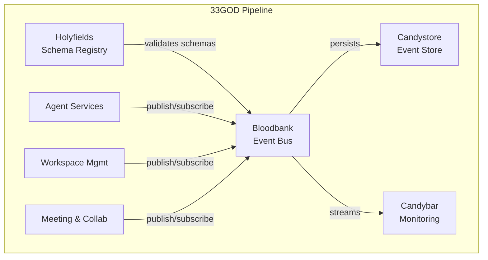

# Bloodbank - GOD Document

> **Guaranteed Organizational Document** - Developer-facing reference for Bloodbank
>
> **Last Updated**: 2026-02-01
> **Domain**: Infrastructure
> **Status**: Production

---

## Product Overview

**Bloodbank** is the **central event bus** of the 33GOD ecosystem, providing RabbitMQ-based messaging infrastructure with schema validation, correlation tracking, and dead-letter queue handling.

Every state change in 33GOD flows through Bloodbank as a typed event.

**Key Capabilities:**
- Topic-based event routing via RabbitMQ topic exchange
- Schema validation against Holyfields definitions
- Correlation ID tracking for distributed tracing
- Dead Letter Queue (DLQ) for failed messages
- Durable subscriptions for fault tolerance

---

## Architecture Position



**Role in Pipeline**: Central nervous system routing all events between components with schema validation and guaranteed delivery.

---

## Event Contracts

### Bloodbank Events Emitted

| Event Name | Routing Key | Payload Schema | Trigger Condition |
|------------|-------------|----------------|-------------------|
| `bloodbank.health.status` | `bloodbank.health.status` | `HealthStatusPayload` | Health check endpoint polled |
| `bloodbank.message.dlq` | `bloodbank.message.dlq` | `DLQPayload` | Message failed routing or validation |
| `bloodbank.schema.validation_failed` | `bloodbank.schema.validation_failed` | `ValidationFailedPayload` | Event fails schema validation |

### Bloodbank Events Consumed

| Event Name | Routing Key | Handler | Purpose |
|------------|-------------|---------|---------|
| `*.*.*` | `#` | `route_event()` | Route all events to subscribers |

**Special Note**: Bloodbank consumes all events for routing, but only emits its own operational events.

---

## Non-Event Interfaces

### CLI Interface

_No CLI interface (service runs as daemon)_

### API Interface

**Base URL**: `http://localhost:8000`

**Endpoints:**

| Endpoint | Method | Description |
|----------|--------|-------------|
| `/health` | GET | Health check (uptime, queue counts) |
| `/metrics` | GET | Prometheus metrics |
| `/publish` | POST | Publish event (admin/testing) |
| `/schemas` | GET | List loaded schemas |
| `/schemas/{event_type}` | GET | Get schema for event type |

**Example: Publish Event**

```bash
curl -X POST http://localhost:8000/publish \
  -H "Content-Type: application/json" \
  -d '{
    "event_type": "test.event.created",
    "payload": {
      "message": "Hello from Bloodbank"
    }
  }'
```

---

## Technical Deep-Dive

### Technology Stack
- **Language**: Python 3.11+
- **Framework**: FastStream (async messaging), FastAPI (REST API)
- **Dependencies**:
  - `aio-pika`: RabbitMQ async client
  - `jsonschema`: Schema validation
  - `pydantic`: Type-safe models
  - `opentelemetry`: Distributed tracing
  - `prometheus-client`: Metrics

### Architecture Pattern

**Event-Driven Message Bus with Schema Validation:**

```
Publisher → Bloodbank → Schema Validation → RabbitMQ → Subscribers
                ↓                              ↓
         Validation Failed              Dead Letter Queue
                ↓
          DLQ Event Emitted
```

**Key Components:**

1. **Publisher API**: Accepts events, wraps in `EventEnvelope`
2. **Schema Validator**: Validates against Holyfields schemas
3. **RabbitMQ Client**: Publishes to topic exchange
4. **Subscriber Framework**: Consumes from queues
5. **DLQ Handler**: Routes failed messages to dead-letter exchange

### Key Implementation Details

**EventEnvelope Structure:**

```python
class EventEnvelope(BaseModel):
    """Canonical event envelope."""
    event_id: UUID
    event_type: str                     # e.g., 'imi.worktree.created'
    timestamp: datetime
    version: str                        # Schema version ('v1')
    source: dict[str, Any]              # Source metadata
    correlation_id: UUID | None         # For tracing
    payload: dict[str, Any]             # Event-specific data
```

**Publisher Implementation:**

```python
class Publisher:
    """Publishes events to Bloodbank topic exchange."""

    async def publish(
        self,
        event_type: str,
        payload: dict[str, Any],
        correlation_id: UUID | None = None
    ) -> UUID:
        # Create envelope
        envelope = EventEnvelope(
            event_id=uuid4(),
            event_type=event_type,
            timestamp=datetime.utcnow(),
            version="v1",
            source=self._get_source_metadata(),
            correlation_id=correlation_id or uuid4(),
            payload=payload
        )

        # Validate against schema
        await self.validator.validate(envelope)

        # Publish to RabbitMQ
        routing_key = event_type  # e.g., 'imi.worktree.created'
        await self.channel.default_exchange.publish(
            Message(body=envelope.model_dump_json().encode()),
            routing_key=routing_key
        )

        return envelope.event_id
```

**Schema Validation:**

```python
class SchemaValidator:
    """Validates events against Holyfields schemas."""

    def __init__(self, schema_dir: Path):
        self.schemas = self._load_schemas(schema_dir)

    async def validate(self, envelope: EventEnvelope) -> None:
        schema = self.schemas.get(envelope.event_type)
        if not schema:
            raise ValidationError(f"No schema for {envelope.event_type}")

        try:
            jsonschema.validate(envelope.payload, schema)
        except jsonschema.ValidationError as e:
            # Emit validation failed event
            await self.emit_validation_failed(envelope, str(e))
            raise
```

### Data Models

**Event Source Metadata:**

```python
class EventSource(BaseModel):
    """Source metadata for event tracking."""
    host: str                           # Hostname
    app: str                            # Application name
    trigger_type: str                   # 'cli', 'api', 'scheduled', 'event'
    user_id: str | None = None          # User/agent ID if applicable
```

**DLQ Payload:**

```python
class DLQPayload(BaseModel):
    """Dead-letter queue event payload."""
    original_event_id: UUID
    original_event_type: str
    failure_reason: str                 # 'validation_failed', 'routing_failed'
    error_message: str
    retry_count: int
    max_retries: int = 3
```

### Configuration

**Environment Variables:**

- `RABBITMQ_URL`: RabbitMQ connection URL (default: `amqp://localhost:5672`)
- `HOLYFIELDS_SCHEMA_DIR`: Path to Holyfields schemas
- `BLOODBANK_EXCHANGE`: Exchange name (default: `bloodbank.events`)
- `BLOODBANK_DLX`: Dead-letter exchange (default: `bloodbank.dlx`)

**Config File** (`bloodbank/config.yaml`):

```yaml
rabbitmq:
  url: "amqp://localhost:5672"
  exchange: "bloodbank.events"
  exchange_type: "topic"
  durable: true

dead_letter:
  exchange: "bloodbank.dlx"
  queue: "bloodbank.dlq"
  ttl_ms: 86400000  # 24 hours

schema_validation:
  enabled: true
  schema_dir: "../holyfields/schemas"
  strict_mode: true  # Reject unknown event types

observability:
  tracing_enabled: true
  metrics_port: 9090
```

---

## Development

### Setup
```bash
# Clone Bloodbank repository
git clone git@github.com:delorenj/bloodbank.git
cd bloodbank

# Install dependencies with uv
uv sync

# Start RabbitMQ (Docker)
docker-compose up -d rabbitmq

# Run Bloodbank
uv run python -m bloodbank
```

### Running Locally
```bash
# Start Bloodbank service
uv run python -m bloodbank

# Publish test event
curl -X POST http://localhost:8000/publish \
  -H "Content-Type: application/json" \
  -d '{
    "event_type": "test.event.created",
    "payload": {"message": "test"}
  }'

# Monitor RabbitMQ Management UI
open http://localhost:15672  # guest/guest
```

### Testing
```bash
# Unit tests
uv run pytest tests/

# Integration tests (requires RabbitMQ)
docker-compose up -d rabbitmq
uv run pytest tests/integration/

# Load testing
uv run locust -f tests/load/bloodbank_load_test.py
```

---

## Deployment

**Docker Deployment:**

```bash
# Build image
docker build -t bloodbank:latest .

# Run with docker-compose
docker-compose up -d bloodbank

# Health check
curl http://localhost:8000/health
```

**Docker Compose:**

```yaml
version: '3.8'
services:
  rabbitmq:
    image: rabbitmq:3-management
    ports:
      - "5672:5672"
      - "15672:15672"

  bloodbank:
    image: bloodbank:latest
    depends_on:
      - rabbitmq
    environment:
      - RABBITMQ_URL=amqp://rabbitmq:5672
      - HOLYFIELDS_SCHEMA_DIR=/schemas
    volumes:
      - ../holyfields/schemas:/schemas
    ports:
      - "8000:8000"
```

**System Requirements:**
- Python 3.11+
- RabbitMQ 3.11+
- 512MB RAM minimum
- CPU: 1 core minimum

---

## References

- **Domain Doc**: `docs/domains/infrastructure/GOD.md`
- **System Doc**: `docs/GOD.md`
- **Source**: `bloodbank/trunk-main/`
- **Event Schemas**: `holyfields/schemas/`
- **RabbitMQ Management**: `http://localhost:15672`
