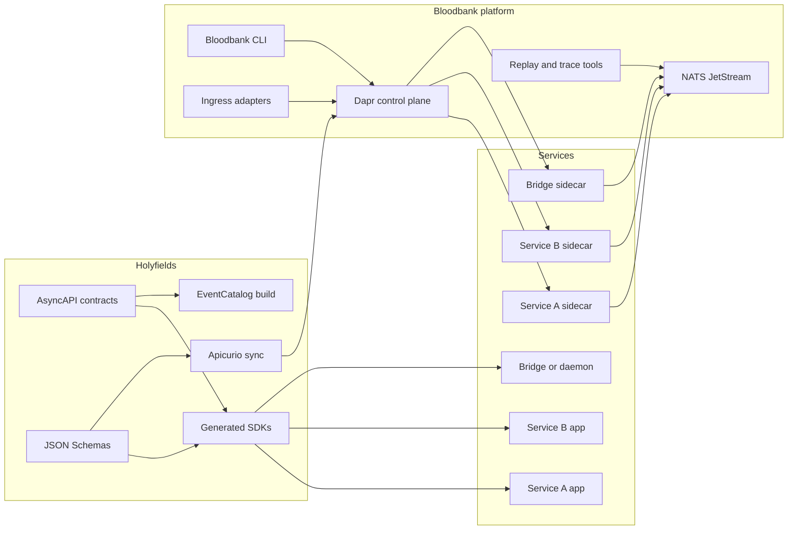

# Bloodbank vNext blueprint

This document defines the target architecture for the Bloodbank overhaul. It is
the working blueprint for the next platform, not a description of the current
deployed stack.

The design goal is simple: keep the event-driven model, throw away the bespoke
transport implementation, and rebuild on standards and self-hosted platform
components that teams can trust, extend, and operate.

## Executive summary

Bloodbank vNext becomes a self-hosted event platform built on Dapr and NATS
JetStream. Holyfields becomes the contract source of truth using AsyncAPI and
service-owned schemas. EventCatalog becomes the human and AI-facing registry.
Apicurio Registry becomes the runtime schema registry. The Bloodbank CLI stays,
but it stops being the primary publishing path and becomes an operator tool.

The new split of responsibility is:

- Holyfields owns contracts, schemas, ownership, generated SDKs, and catalog
  generation.
- Bloodbank owns runtime platform operations, Dapr components, broker setup,
  replay tooling, tracing, and safe ingress or egress adapters.
- Individual services own the events and commands they introduce, but they do
  so through Holyfields contracts instead of ad hoc local models.

## What changes and what stays

The architecture changes a lot, but the big requirements stay intact.

These requirements remain unchanged:

- Immutable events with one common event envelope.
- Separate mutable commands for requested actions.
- Strictly typed, modular, service-owned contracts.
- One central registry and catalog called Holyfields.
- Self-hosted infrastructure with Docker Compose as the default deployment
  model.

These implementation choices change:

- RabbitMQ-specific application plumbing is replaced with a platform runtime.
- Runtime schema lookup in the Bloodbank app is removed.
- The Bloodbank HTTP API stops being the main path for normal event publishing.
- The CLI stops being the main publishing path for production services.
- The registry becomes contract-first and generated, not inferred at runtime.

## Selected stack

This is the selected target stack.

| Layer | Selection | Why |
| --- | --- | --- |
| Runtime platform | Dapr | Sidecar model, polyglot support, self-hosted, standard runtime APIs |
| Broker | NATS JetStream | Subject-based routing, durable streams, replay, self-hosted, Docker friendly |
| Event envelope | CloudEvents 1.0 | Standard immutable event metadata model |
| Contract spec | AsyncAPI | Event and command channel contracts, request or reply modeling |
| Schema format | JSON Schema | Natural fit with CloudEvents payloads and Dapr-facing JSON flows |
| Schema registry | Apicurio Registry | Self-hosted registry for shared schema governance |
| Architecture catalog | EventCatalog | Discoverability, ownership, diagrams, AI-friendly registry |
| SDK generation | Holyfields-generated Python and TypeScript packages | Makes contracts the default integration path |

## Why this stack fits 33GOD

This stack makes Bloodbank thinner and Holyfields stronger.

CloudEvents standardizes the immutable event envelope. AsyncAPI models channels,
operations, and correlation. EventCatalog gives you the discoverability layer
that Bloodbank never should have tried to own. Apicurio gives you a proper
registry instead of path guessing. Dapr absorbs runtime plumbing that otherwise
gets rebuilt in Python, TypeScript, and Rust over and over again.

NATS JetStream is the broker reset that matches the bigger rethink. It keeps
subject-based routing simple, supports durable consumers and replay, and fits
Docker Compose deployment well.

## Core architecture

The target topology is below.



## Contract model

Holyfields is the center of the system. Everything else consumes what
Holyfields publishes.

### Events

Events are immutable facts. They use CloudEvents 1.0 as the common envelope.

Required event fields:

- `id`
- `specversion`
- `source`
- `type`
- `time`
- `subject`
- `datacontenttype`
- `dataschema`
- `data`

Required CloudEvents extensions for Bloodbank:

- `correlationid`
- `causationid`
- `producer`
- `service`
- `domain`
- `schemaref`
- `traceparent`

Event type naming stays domain-oriented:

- `agent.thread.updated`
- `artifact.created`
- `meeting.transcript.completed`

NATS subject naming stays transport-oriented and explicit:

- `event.agent.thread.updated`
- `event.artifact.created`
- `event.meeting.transcript.completed`

### Commands

Commands are not facts. Commands are requests with delivery and lifecycle
semantics. They do not reuse the event envelope.

Commands use a separate `CommandEnvelope` with these required fields:

- `command_id`
- `command_type`
- `target_service`
- `issued_by`
- `issued_at`
- `timeout_ms`
- `correlation_id`
- `causation_id`
- `reply_to`
- `payload_schema`
- `payload`

Optional command lifecycle fields:

- `supersedes`
- `expected_revision`
- `priority`
- `cancel_if_not_started_by`
- `dedupe_key`

Command type naming:

- `agent.execute_step`
- `artifact.rebuild`
- `meeting.process_transcript`

NATS subject naming:

- `command.agent-runner.execute_step`
- `command.artifact-service.rebuild`
- `command.meeting-service.process_transcript`

Reply subject naming:

- `reply.agent-runner.execute_step`
- `reply.artifact-service.rebuild`

### Ownership model

Each service owns the contracts it introduces. That ownership is declared in
Holyfields, not inferred from runtime code.

The rule is:

- The producing service owns event schemas.
- The target service owns command schemas.
- Shared schema fragments live in Holyfields common components.
- Bloodbank owns no business event schemas.

## Holyfields vNext

Holyfields stops being a schema directory that Bloodbank happens to look at. It
becomes the contract build system for the whole platform.

### Holyfields responsibilities

Holyfields owns these artifacts:

- Service-level AsyncAPI documents.
- Shared JSON Schema components.
- Generated Python and TypeScript SDKs.
- EventCatalog source and generated site content.
- Registry synchronization into Apicurio.
- Contract validation, compatibility checks, and CI policy.

### Holyfields repository shape

This is the recommended repository layout.

```text
holyfields/
  services/
    artifact-service/
      asyncapi.yaml
      schemas/
        events/
          artifact-created.json
        commands/
          rebuild-artifact.json
    agent-runner/
      asyncapi.yaml
      schemas/
        events/
        commands/
  common/
    schemas/
      cloudevents/
      commands/
      primitives/
  generated/
    python/
    typescript/
  catalog/
    eventcatalog/
  registry/
    apicurio/
  scripts/
```

### Holyfields workflow

This is the required lifecycle for adding any new contract.

1. Add or update the service AsyncAPI document.
2. Add the service-owned JSON Schema files.
3. Run Holyfields validation locally.
4. Generate SDKs and catalog output.
5. Run compatibility checks in CI.
6. Publish generated SDKs and sync registry state.
7. Only then let services adopt the contract.

No service is allowed to publish a new event or command type by inventing a
local model first.

## Bloodbank vNext

Bloodbank becomes the platform repo for runtime and operations.

### Bloodbank responsibilities

Bloodbank owns these concerns:

- Dapr component manifests.
- NATS JetStream stream and consumer topology.
- Docker Compose deployment of the platform stack.
- Ingress adapters for external systems.
- Replay, trace, and inspection tooling.
- Operator-facing CLI.
- Shared observability, retries, dead-letter policy, and cutover mechanics.

Bloodbank does not own business contract definitions.

### Bloodbank repository shape

This is the recommended repository layout.

```text
bloodbank/
  docs/
    architecture/
  compose/
    docker-compose.yml
    components/
      dapr/
      nats/
      apicurio/
      eventcatalog/
  cli/
    bb/
  adapters/
    github/
    hookd/
    fireflies/
  ops/
    replay/
    trace/
    bootstrap/
  examples/
```

### Bloodbank CLI role

The CLI remains important, but its role changes.

The CLI is for:

- health checks
- publishing test traffic
- replaying messages
- tracing message paths
- checking registry or catalog sync
- validating local manifests

The CLI is not for:

- being the primary production publish path
- inventing schemas on the fly
- bypassing generated SDKs

## Docker Compose stack

The default deployment model is Docker Compose.

The minimum vNext stack is:

- `nats`
- `dapr-placement`
- `dapr-scheduler`
- `apicurio-registry`
- `eventcatalog`
- one service container per app
- one Dapr sidecar per app

Optional supporting services:

- `redis` for Dapr state or workflow building blocks
- `tempo` or `jaeger` for tracing
- `grafana` and `prometheus` for dashboards and alerts

## Reliability model

The reliability rules must be platform-wide, not service-specific folklore.

### Delivery rules

- At-least-once delivery is the default assumption.
- Every consumer must implement idempotency.
- Replay is a feature, not an accident.
- Dead-letter handling must be observable and replayable.

### Contract rules

- Events are additive-only in normal evolution.
- Commands may version faster, but breaking changes still require explicit
  schema versioning and migration notes.
- Removing or renaming fields requires a migration plan.
- Holyfields CI must block incompatible contract changes.

### Traceability rules

- Every event and command must carry correlation and causation identifiers.
- Every publish path must carry `traceparent`.
- Replays must preserve original identifiers while adding replay metadata.

## Security model

The current repo blurred internal tooling and production transport. vNext must
separate those concerns.

Security rules:

- No anonymous publish endpoints in production.
- No business publish path that bypasses Dapr or generated SDKs.
- No embedded broker credentials in source.
- Registry and catalog are internal services, not public internet endpoints.
- CLI operator credentials must be separate from service credentials.

## Team workstreams

This overhaul is large enough that it must be run as parallel workstreams.

### Workstream 1: Holyfields contracts

Mission: make Holyfields the contract source of truth.

Deliverables:

- base CloudEvents schema package
- base command envelope schema package
- first service AsyncAPI documents
- compatibility checking in CI
- generated Python and TypeScript SDKs
- EventCatalog generation

### Workstream 2: Platform bootstrap

Mission: stand up the self-hosted runtime stack.

Deliverables:

- Docker Compose stack for NATS, Dapr, Apicurio, and EventCatalog
- bootstrapping scripts
- Dapr component manifests
- local developer startup and teardown commands

### Workstream 3: Reference vertical slice

Mission: prove the architecture with one service end-to-end.

Choose one moderate-complexity domain and implement:

- one command
- one command reply
- two immutable events
- one generated SDK in Python
- one generated SDK in TypeScript
- one replay flow
- one EventCatalog page set

Do not migrate the whole estate before this slice is working.

### Workstream 4: Adapter migration

Mission: move bridges and producers onto the new platform.

Priority order:

1. `hookd_bridge`
2. `openclaw_bridge`
3. `infra_dispatcher`
4. HTTP ingress or webhook adapters

Each migration must remove bespoke envelope logic, not wrap it in another
layer.

### Workstream 5: Observability and operations

Mission: make the platform debuggable before broad rollout.

Deliverables:

- trace propagation
- replay tooling
- dead-letter inspection
- stream lag and consumer health dashboards
- contract drift checks between Holyfields and runtime

### Workstream 6: Cutover and retirement

Mission: move production traffic safely and retire v2.

Deliverables:

- dual-publish or shadow-read strategy where needed
- cutover checklist per service
- rollback plan per service
- decommission plan for old HTTP publish paths and old relay logic

## Rollout phases

This is the recommended execution order.

### Phase 0: Freeze and inventory

Freeze new ad hoc event types in the current repo. Inventory all current
producers, consumers, routing keys, schemas, and unofficial publish paths.

### Phase 1: Build Holyfields foundation

Create the base envelope schemas, first AsyncAPI documents, SDK generation, and
catalog generation. Nothing else should move first.

### Phase 2: Bootstrap the platform

Stand up the Compose stack and operator CLI. Prove local startup, publish,
consume, replay, and schema lookup end-to-end.

### Phase 3: Ship the reference slice

Move one real domain through Holyfields, Dapr, NATS, and EventCatalog. Use it
to validate the developer workflow and runtime behavior.

### Phase 4: Migrate adapters and first-party services

Move the known bridges and first-party services onto generated SDKs and Dapr
sidecars. Remove direct publishing code as each service cuts over.

### Phase 5: Retire v2

Turn off the old Bloodbank HTTP publish path, the bespoke schema validator, and
the duplicate relay logic. Retain replay and audit data as needed.

## Exit criteria

Do not declare the overhaul complete until all of these are true:

- Every production event type exists in Holyfields.
- Every production command type exists in Holyfields.
- Every production service uses generated SDKs or a thin approved adapter.
- Bloodbank no longer performs schema discovery from local paths.
- The CLI is not the primary production publish path.
- The old anonymous or ad hoc publish endpoints are gone.
- Replay, dead-letter inspection, and correlation tracing work end-to-end.

## Immediate next actions

Start with these concrete steps:

1. Create the Holyfields base CloudEvents and command envelope packages.
2. Stand up a Compose sandbox with NATS, Dapr, Apicurio, and EventCatalog.
3. Pick one reference domain for the vertical slice.
4. Generate the first Python and TypeScript SDKs.
5. Replace one direct publisher with the generated SDK plus Dapr path.

## Sources

- CloudEvents specification:
  <https://github.com/cloudevents/spec/blob/v1.0.2/cloudevents/spec.md>
- AsyncAPI document structure:
  <https://www.asyncapi.com/docs/concepts/asyncapi-document/structure>
- EventCatalog:
  <https://www.eventcatalog.dev/>
- Apicurio Registry documentation:
  <https://www.apicur.io/registry/docs/apicurio-registry/3.1.x/index.html>
- Dapr pub/sub overview:
  <https://docs.dapr.io/developing-applications/building-blocks/pubsub/pubsub-overview/>
- Dapr with CloudEvents:
  <https://docs.dapr.io/developing-applications/building-blocks/pubsub/pubsub-cloudevents/>
- NATS Docker and operations:
  <https://docs.nats.io/running-a-nats-service/nats_docker>
