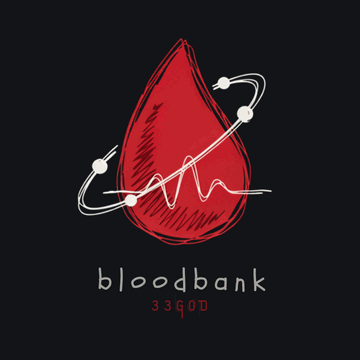

# n8n Bloodbank nodes

Schema-backed publisher, consumer trigger, Plane webhook ingress, and
agent-fleet dispatch for the 33GOD Bloodbank NATS bus.

## Nodes

| Node | Group | What it does |
| --- | --- | --- |
| **Bloodbank** | output | Publishes a canonical event or registry-routed invocation command. Also usable as an agent tool. |
| **Bloodbank Trigger** | trigger | Starts workflows from events or single-consumer commands. |
| **Plane → Bloodbank** | transform | Verifies, normalizes, and publishes Plane webhooks. |
| **33GOD Agent Fleet** | output | Hands a ticket to the fleet agent that owns its board. Also usable as an agent tool. |

Each node carries the Bloodbank mark as a light/dark icon pair, so the canvas
reads correctly in either n8n theme. Plane → Bloodbank adds an inbound arrow to
mark it as the edge where outside traffic enters the bus; 33GOD Agent Fleet adds
an outbound fan to mark it as the edge where work leaves for an agent.

## Bloodbank publisher

Event mode remains the default for existing workflows. Command mode publishes
`bloodbank.agent.invocation.start` to
`bloodbank.cmd.agent.invocation.start`. It requires a repository, non-empty
prompt, and retry-stable command UUID, then resolves exactly one eligible agent
from `~/.hermes/agents-registry.yaml`. Profile names remain inside the registry
and are never embedded in workflow data or the command envelope.

The finished command envelope is validated against the canonical JSON Schema
before a NATS connection is opened. Its generated idempotency key is scoped to
the resolved target and command UUID; malformed schemas, registry routes, or
command inputs therefore make zero transport attempts.

## Bloodbank Trigger

Choose Events to bind one or more event schemas. Event delivery is always
asynchronous. The list also includes Plane provenance aliases such as On Ticket
Created (plane.ticket.created); aliases subscribe to the canonical repo subject
and filter data.provider_event_type.

Choose Command to bind exactly one command schema. A queue group preserves
single-consumer dispatch among equivalent n8n workflows.

- Asynchronous command processing starts the workflow and publishes no reply.
- Synchronous command processing waits for the n8n run to finish and publishes
  a correlated Bloodbank reply on the matching bloodbank.rpy subject.

The trigger uses the maintained official NATS Node transport and reconnects
automatically. Defaults use the localhost service hostname and can be overridden
per node.

## Plane ingress

Import the versioned workflow:

    n8n import:workflow --input=../n8n-workflows/plane-bloodbank.v1.json
    n8n update:workflow --id=iMw484J1ZCqKME2C --active=true

The Webhook node must retain Raw Body. Plane to Bloodbank rejects unsigned or
invalid requests before publishing. `Webhook Secret References` is a JSON
allowlist mapping each trusted Plane `webhook_id` to an `op://` or `env://`
reference; raw values are rejected. Selecting the secret by webhook ID lets one
HTTPS ingress serve multiple Plane workspaces without treating a workspace name
as a trust boundary. Unknown webhook IDs fail before Bloodbank publication.

The committed workflow trusts the production 33GOD and AutomaticAI workspace
webhook IDs. Their independent signing keys live in the DeLoSecrets items
`PlaneWebhook-33GOD` and `PlaneWebhook-AutomaticAI`.

Routing metadata comes from ~/.hermes/agents-registry.yaml. Plane project IDs
map to repo slug, workspace, and project identifier without embedding host
addresses or credentials.

The registry entry must match the repo-root `.project.json` ticket-provider
binding. Re-run the PM fleet-registry reconciliation after a board migration;
an unknown board is acknowledged as unrouted and is never guessed from the
workspace alone.

## 33GOD Agent Fleet

Publishes one `bloodbank.agent.invocation.start` command addressed to the fleet
agent that owns a ticket's board. It replaces a shell-out to
`bin/bb-triage-invoke`, so the lifecycle workflows now run on the same
schema-validated transport as everything else on the bus.

| Operation | What the agent is asked to do |
| --- | --- |
| **Groom Ticket** | Enrich one new ticket in place — labels, module, priority, cycle, exposure label, a description someone who just walked in could act on — then stamp the completion label. It is told not to split the ticket or change its state. |
| **Delegate Ticket** | Pick up a groomed ticket that reached Todo, judge its acceptance criteria, delegate the work to a worker agent, and move it to In Progress with a start date. |
| **Invoke Agent** | Send your own prompt to the agent that owns the board. |

Every field is lifted from the Bloodbank envelope on the input, so a trigger
feeds this node with no field mapping at all. The Ticket collection overrides any
of them when the input is not an envelope.

**Board id resolves the agent, not the repo slug.** The board id is the one
identifier a provider webhook always carries, and it is what tells a
multi-tenant Plane which workspace to answer as. A board with no `plane` entry in
the registry falls back to `<repo>-pm` by convention, so a project works with no
code change.

**An ineligible project is a green skip.** Eligibility mirrors hermes-gateway's
own four conditions — `profile_name`, `bloodbank.enabled`, `gateway_scope: fleet`
and a matching `target_agent_id`. When any fails, the node reports the reason and
publishes nothing rather than failing, so one shared trigger over every project's
tickets does not turn the switched-off ones into red executions. Set On
Ineligible Agent to Error to invert that.

**One thread per ticket.** A command's correlation id would otherwise default to
its own command id, giving every invocation a fresh thread — and the generic
derivation hashes the event type, which is a constant, collapsing every ticket
into one conversation. This node derives it as
`uuid5(url_ns, "plane:<board>:<ticket>")`, so a ticket is a conversation and a
redelivered webhook lands on the same idempotency key. The port is asserted
byte-identical to the Python publisher it replaces.

### The lifecycle lane

Two versioned workflows chain through it:

    n8n import:workflow --input=../n8n-workflows/ticket-grooming.v1.json
    n8n import:workflow --input=../n8n-workflows/ticket-delegation.v1.json

`plane.ticket.created` → **Groom Ticket**, which finishes by labelling the ticket
`lifecycle:triaged`. A person then promotes the ticket to Todo, and
`plane.ticket.transitioned` → **Delegate Ticket** picks it up. The label is the
handshake between the two: grooming is automatic, promotion to Todo is the human
decision, and delegation requires both. Delegate Ticket grooms a ticket itself
when the label is missing rather than delegating unreviewed work.

## Branding

`src/icons/` holds the icon masters, drawn from the Bloodbank mark at the
repository root. They are the single source of truth. n8n resolves a `file:`
icon next to the `.node.js` that declares it, so `npm run build` fans the
masters out into every compiled node directory and fails the build when a node
declares an icon that no master satisfies. Edit the master, never the copy
under `dist/`.

| Asset | Shipped as | Use |
| --- | --- | --- |
| `src/icons/bloodbank.svg` · `bloodbank.dark.svg` | `dist/nodes/{Bloodbank,BloodbankTrigger}/` | Publisher and trigger canvas icon |
| `src/icons/planeBloodbank.svg` · `planeBloodbank.dark.svg` | `dist/nodes/PlaneBloodbank/` | Plane ingress canvas icon |
| `assets/bloodbank.png` | package tarball | README and package listing |

Palette sampled from the source mark: `#C4222C` blood red and `#8E141C` deep
red on light canvases, lifted to `#D2242F`/`#9C1820` on dark ones; `#FAF8F7`
off-white for the orbit, pulse, and nodes; `#23252C` ink where those marks fall
outside the drop on a light canvas.

## Development and verification

    npm ci
    npm test
    npm run test:live
    npm run deploy

npm test covers schema generation, trigger and publisher configuration,
canonical envelopes, fail-closed invocation routing, Plane
creation/transition/comment normalization, provenance alias filters, and the
node icon contract. npm run test:live proves multi-event subscriptions, command
queue competition, and synchronous command replies against the live NATS
service.
