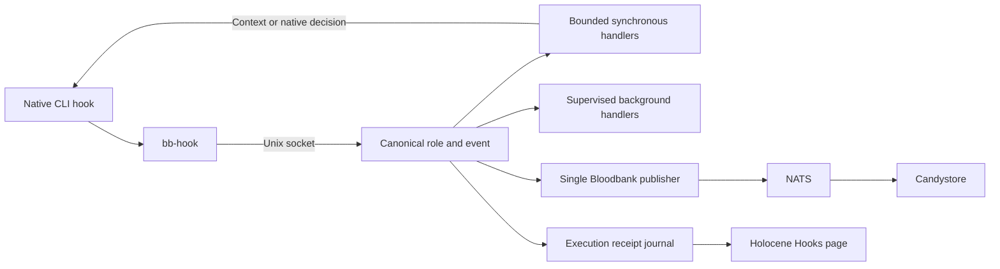

# Hook hub

Every supported CLI invokes `bb-hook` once per native hook. The host daemon
resolves that native hook into the canonical lifecycle role and Bloodbank event,
selects behavioral handlers from `handlers.toml`, and owns event publication.
CLI configuration contains the adapter entry point; behavioral wiring belongs in
one registry.



Claude, Codex, Copilot, Hermes, Antigravity, Gemini, Kimi, and OpenCode have
adapters. Installed inventory separately reports whether each executable and
native configuration exist. OpenClaw is explicitly unsupported. Some Hermes
signals have no Bloodbank event contract; these can run local handlers without
inventing an event type.

## Runtime ownership

The Unix socket keeps synchronous context and approval decisions on the local
CLI path. Background handlers and NATS publication are supervised by the hub.
Handlers receive bounded launch context for host integrations such as Orca and
Zellij, plus `BB_HOOK_HUB=off` to prevent recursion.

The internal `bloodbank-publish` handler is the sole publisher for a native
invocation. Cached legacy `publish.py` commands forward to the hub once its
ownership manifest is active. Explicit native invocation, event, or tool-call IDs
provide durable duplicate suppression. A fresh UUID is used when the CLI supplies
no usable identity; matching prompt text alone never suppresses legitimate work.
This is not an exactly-once guarantee for a transport retry without stable IDs.

`~/.config/33god/hook-hub/ownership.json` records the centralized concerns.
Legacy handlers and their installers honor that manifest. Pausing a central
handler does not silently restore its old native wiring.

## Concern applicability

Native adapter coverage and behavioral applicability are separate. A registered
native hook with no matching concern is not missing a hook. The registry's `clis`,
`on`, and `on_native` fields declare the supported intersection; wrappers record
explicit skips for absent project context or optional tools.

| Concern | Applicable CLIs and runtime requirements |
| --- | --- |
| Hindsight, skill reminder, skill lint | Portable where the native adapter provides the matching lifecycle role and required prompt, session, or file-edit payload. Retention is session-close work; candidate writes are not retain receipts. |
| CodeGraph prompt context | Claude, Codex, Copilot, Kimi, Gemini, OpenCode, Hermes; the working repository must have an index. |
| Code Review Graph status/update | Claude, Codex, OpenCode; the repository must have a Code Review Graph index. The before-commit decision is OpenCode-specific. |
| Project Notebook | Claude only: its canonical PJangler engine accepts Claude identities and SessionStart/SessionEnd. Other CLIs must not be relabeled as Claude. Non-repository work is skipped; the project must also be registered and configured in PJangler. |
| Merge forward | Matching session closure in a repository that owns the `33god-merge-forward` tuner worker. Other repositories are skipped. |
| Orca status | Claude, Codex, Copilot, Kimi, Hermes, Antigravity; an Orca pane and usable endpoint are required. |
| Nanoleaf | Claude lifecycle and attention signals, with the existing panel runtime. |
| Sound notifications | Claude/Codex attention signals, Codex turn completion, and OpenCode session closure. |
| Zellij attention and Git checkpoint | OpenCode only; attention requires a Zellij pane, and the existing checkpoint project opt-out is preserved. |

Project Notebook, Nanoleaf, CodeGraph, Orca, CommonProject/PJangler projections,
and guarded project fallbacks consult the same ownership contract so ordinary
reinstallation does not restore retired native owners. Standalone installations
without a central owner retain their existing behavior.

## Installation and cutover

```sh
mise run hub:install
python3 services/hook-hub/cutover.py --project /path/to/project
python3 services/hook-hub/cutover.py --project /path/to/project --apply --install
python3 services/agent-hooks/sync.py --check-installed --json
python3 services/agent-hooks/health/hook_healthcheck.py --json
```

The first cutover command is a read-only plan. The combined apply/install captures
Codex native trust before pruning known legacy handlers, renders and installs the
canonical adapters, then preserves existing trust choices while trusting the new
managed entry points. It discovers Hermes profiles and alternate Codex runtime
homes. It preserves foreign hooks and configuration properties.

Verify the native CLI loader as well as static inventory before activating staged
behavioral rows:

```sh
python3 services/hook-hub/cutover.py --project /path/to/project --activate
```

Activation refuses to proceed while inspected legacy managed commands remain.
The registry reloads on mtime changes; code changes require a service restart.
Native CLIs that cache their hook configuration need a fresh session for newly
added native hook types. The legacy publisher compatibility path covers existing
registered publisher commands.

## Receipts and Holocene

The metadata-only SQLite journal records received, selected, started, succeeded,
failed, timed-out, skipped, interrupted, and duplicate-suppressed work. Background
children remain supervised until completion. Session-end retention waits for
pending candidate writes from the same session.

The read-only HTTP API binds to loopback by default:

| Endpoint | Result |
| --- | --- |
| `/v1/hooks/status` | Registry, mappings, installed wiring, and aggregate activity |
| `/v1/hooks/invocations` | Paginated execution receipts |
| `/v1/hooks/invocations/{id}` | One receipt with its lifecycle timeline |

History accepts `cli`, `native`, `role`, `handler`, `status`, `limit`, and `offset`.
Holocene proxies these under `/api/modules/hooks` and presents them at `/hooks`.
Configuration proves wiring; a receipt proves observed execution. Quiet hooks
remain visibly unobserved.

A publication receipt marked `sent` means NATS transport succeeded. It is not a
Candystore persistence acknowledgment. Durable delivery acceptance must separately
look up the event ID in Candystore. Receipts do not store prompts, transcripts,
stdout, stderr, or environment values.

## Deadlines and failure behavior

Ordinary client calls have a 3-second total deadline and a 2.5-second synchronous
budget. Prompt hooks that recall Hindsight use a 15-second client deadline within
a 16-second native timeout, with up to 14 seconds of shared synchronous work.
The recall handler itself is capped at 11 seconds. Each other handler has its own
registry timeout.

The client fails open on unavailable sockets, malformed replies, or elapsed
deadlines. A deliberate, valid native denial is preserved. Hung handler process
groups are terminated and recorded as timed out. A malformed registry retains the
last good configuration and surfaces the error in Holocene. None of these states
are reported as successful execution.

## Configuration

| Variable | Default | Purpose |
| --- | --- | --- |
| `BB_HOOK_HUB` | unset | `off` disables client recursion |
| `BB_HOOK_SOCKET` | `$XDG_RUNTIME_DIR/33god/hook-hub.sock` | Unix socket |
| `BB_HOOK_DEADLINE` | `3.0` | Client total deadline, seconds |
| `HOOK_HUB_REGISTRY` | `handlers.toml` beside the daemon | Behavioral registry |
| `HOOK_HUB_SYNC_BUDGET` | `2.5` | Default shared synchronous deadline |
| `HOOK_HUB_MAX_SYNC_BUDGET` | `14.0` | Maximum shared synchronous deadline |
| `HOOK_HUB_ASYNC_SLOTS` | `8` | Concurrent background handlers |
| `HOOK_HUB_RECEIPTS` | `$XDG_STATE_HOME/33god/hook-hub/receipts.sqlite3` | Receipt database |
| `HOOK_HUB_LOG` | `$XDG_STATE_HOME/33god/hook-hub/hub.log` | Rotating diagnostic log |
| `HOOK_HUB_HTTP_HOST` | `127.0.0.1` | Read-only API bind address |
| `HOOK_HUB_HTTP_PORT` | `8685` | Read-only API port; zero disables it |
| `HOOK_HUB_PUBLISH` | `true` | Central publisher enabled |

Unset XDG state/runtime paths use the user's standard local state and runtime
locations. Runtime files remain outside the source checkout.

## Development

```sh
python3 -m pytest services/hook-hub/tests services/agent-hooks/tests
```

Add a behavioral row to `handlers.toml`, bind it with `on` lifecycle roles or
`on_native`, and optionally narrow it with `clis`. Sync handlers return context or
native decisions. Async handlers emit supervised outcomes. Retire any equivalent
native registration before enabling the new row.
