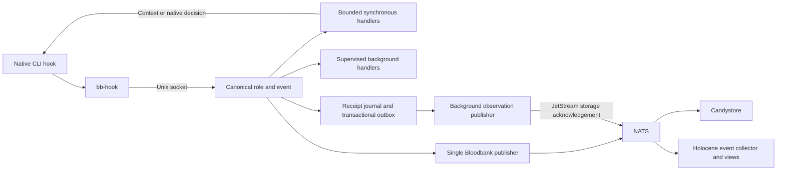

# Hook hub

Every supported CLI invokes `bb-hook` once per native hook. The host daemon
resolves that native hook into the canonical lifecycle role and Bloodbank event,
selects behavioral handlers from `handlers.toml`, and owns event publication.
CLI configuration contains the adapter entry point; behavioral wiring belongs in
one registry.



Claude, Codex, Copilot, Hermes, Antigravity, Gemini, Kimi, and OpenCode have
adapters. Installed inventory separately reports whether each executable and
native configuration exist. OpenClaw is explicitly unsupported. Some Hermes
signals have no canonical agent lifecycle event; these can run local handlers.
Their receipt changes still have the registered `bloodbank.agent.hook.updated`
observability contract.

## Runtime ownership

The Unix socket keeps synchronous context and approval decisions on the local
CLI path. Background handlers and NATS publication are supervised by the hub.
Handlers receive bounded launch context for host integrations such as Orca and
Zellij, plus `BB_HOOK_HUB=off` to prevent recursion.

The internal `bloodbank-publish` handler is the sole publisher of the original
agent lifecycle fact for a native invocation. Observation revisions are separate
facts and do not invoke this handler. Cached legacy `publish.py` commands forward to the hub once its
ownership manifest is active. Explicit native invocation, event, or tool-call IDs
provide durable duplicate suppression. A fresh UUID is used when the CLI supplies
no usable identity; matching prompt text alone never suppresses legitimate work.
This is not an exactly-once guarantee for a transport retry without stable IDs.

`~/.config/33god/hook-hub/ownership.json` records the centralized concerns.
Legacy handlers and their installers honor that manifest. Pausing a central
handler does not silently restore its old native wiring.

## Concern applicability

Native adapter coverage and behavioral applicability are separate. A registered
native hook with no matching concern is not missing a hook. The registry's `clis`,
`on`, and `on_native` fields declare the supported intersection; wrappers record
explicit skips for absent project context or optional tools.

| Concern | Applicable CLIs and runtime requirements |
| --- | --- |
| Hindsight, skill reminder, skill lint | Portable where the native adapter provides the matching lifecycle role and required prompt, session, or file-edit payload. Retention is session-close work; candidate writes are not retain receipts. |
| CodeGraph prompt context | Claude, Codex, Copilot, Kimi, Gemini, OpenCode, Hermes; the working repository must have an index. |
| Code Review Graph status/update | Claude, Codex, OpenCode; the repository must have a Code Review Graph index. The before-commit decision is OpenCode-specific. |
| Project Notebook | Claude only: its canonical PJangler engine accepts Claude identities and SessionStart/SessionEnd. Other CLIs must not be relabeled as Claude. Non-repository work is skipped; the project must also be registered and configured in PJangler. |
| Merge forward | Matching session closure in a repository that owns the `33god-merge-forward` tuner worker. Other repositories are skipped. |
| Orca status | Claude, Codex, Copilot, Kimi, Hermes, Antigravity; an Orca pane and usable endpoint are required. |
| Nanoleaf | Claude lifecycle and attention signals, with the existing panel runtime. |
| Sound notifications | Claude/Codex attention signals, Codex turn completion, and OpenCode session closure. |
| Zellij attention and Git checkpoint | OpenCode only; attention requires a Zellij pane, and the existing checkpoint project opt-out is preserved. |

Project Notebook, Nanoleaf, CodeGraph, Code Review Graph, Orca, CommonProject/PJangler projections,
and guarded project fallbacks consult the same ownership contract so ordinary
reinstallation does not restore retired native owners. Standalone installations
without a central owner retain their existing behavior.

The managed `~/.local/bin/code-review-graph` launcher delegates to the installed
uv tool. While the hub owns its concern, `install` and its `init` alias receive
`--no-hooks`; other commands and arguments pass through. The tool package remains
upstream-owned. `hub:install` and combined cutover installation restore this link
if a uv tool reinstall replaces it. To refresh just the launcher:

```sh
python3 services/hook-hub/tool_guards.py --install
```

## Installation and cutover

```sh
mise run hub:install
python3 services/hook-hub/cutover.py --project /path/to/project
python3 services/hook-hub/cutover.py --project /path/to/project --apply --install
python3 services/agent-hooks/sync.py --check-installed --json
python3 services/agent-hooks/health/hook_healthcheck.py --json
```

The first cutover command is a read-only plan. The combined apply/install captures
Codex native trust before pruning known legacy handlers, renders and installs the
canonical adapters, then preserves existing trust choices while trusting the new
managed entry points. It discovers Hermes profiles and alternate Codex runtime
homes. It preserves foreign hooks and configuration properties.

Verify the native CLI loader as well as static inventory before activating staged
behavioral rows:

```sh
python3 services/hook-hub/cutover.py --project /path/to/project --activate
```

Activation refuses to proceed while inspected legacy managed commands remain.
The registry reloads on mtime changes. Daemon (`hub.py`) code changes require a
service restart; handler code (`concerns.py`, `hindsight.py`) runs as a fresh
process per hook and does not.
Native CLIs that cache their hook configuration need a fresh session for newly
added native hook types. The legacy publisher compatibility path covers existing
registered publisher commands.

## Receipts and Holocene

The metadata-only SQLite journal records received, selected, started, succeeded,
failed, timed-out, skipped, interrupted, and duplicate-suppressed work. Background
children remain supervised until completion. Session-end retention waits for
pending candidate writes from the same session.

The read-only HTTP API binds to loopback by default:

| Endpoint | Result |
| --- | --- |
| `/v1/hooks/status` | Registry, mappings, installed wiring, and aggregate activity |
| `/v1/hooks/invocations` | Paginated execution receipts |
| `/v1/hooks/invocations/{id}` | One receipt with its lifecycle timeline |

History accepts `cli`, `native`, `role`, `handler`, `status`, `limit`, and `offset`.
This API is a local operator diagnostic interface. Holocene consumes Bloodbank
events and owns its collected read model; it does not proxy this API or read the
hub's SQLite database. Configuration proves wiring; a receipt proves observed
execution. Quiet hooks remain visibly unobserved.

Two schema-backed CloudEvents feed that collector:

| Type | Data |
| --- | --- |
| `bloodbank.agent.hook.updated` | The latest complete invocation revision with execution outcomes and recent timeline, including unmapped native signals, skips, failures, recovery, and deduplicated requests; bursts are coalesced (below) |
| `bloodbank.system.hook.updated` | Either a full `snapshot` of installed wiring and hub health, or a compact `heartbeat` containing health and aggregate activity |

Both carry `schema_version`, a persistent UUID `hub_id`, and equal monotonic
`sequence`/`revision` values. UUIDv5 event IDs remain unchanged on transport
retries; the same ID is also the `Nats-Msg-Id` header. Consumers deduplicate
envelope IDs and only apply a newer revision to the same hub/invocation. The
producer's observed timestamp is retained; broker delivery time cannot make old
health appear fresh. System observations expire after 90 seconds.

Full snapshots are sent at startup, when inventory/configuration changes, and
hourly so a new collector can bootstrap within broker retention. Compact health
is sent every 30 seconds and only merges into a snapshot from the same `hub_id`.
The September 13 deployed inventory yields a 221,261-byte full event and a
23,550-byte compact event, below the broker's 1 MiB limit. All events are bounded
to 900,000 bytes including envelope metadata. Receipt projections retain the
latest 512 timeline entries with explicit `timeline_total` and
`timeline_truncated` fields. Snapshot fields are selected through the shared schema allowlist, so newly added
raw config, command, or environment keys cannot silently enter the feed.

### Coalescing (2026-09-23)

One native hook mutates its receipt about 13 times in a second or two: the
claim, then every handler's select, start and finish. Publishing each of those
as a full revision put ~20 `bloodbank.agent.hook.updated` events per second on
`bloodbank.evt.>` under a busy multi-agent session (about 93% of everything
Candystore stored), although Holocene keeps only the newest revision per
invocation. The outbox now coalesces instead:

- An unpublished revision is **superseded**, not queued behind: the next change
  to the same invocation deletes it and enqueues the new projection under a new,
  higher `sequence`/`revision` in the same transaction. A row already on the
  wire is simply superseded; its late acknowledgement deletes nothing.
- A **settled** invocation (no execution selected or started, status no longer
  `received`) is due at once. An unsettled one waits for
  `HOOK_HUB_OBSERVATION_DEBOUNCE` seconds of quiet, and never longer than
  `HOOK_HUB_OBSERVATION_MAX_DELAY` after its first unpublished change, so a
  long handler still shows as `started` and a duplicate storm cannot starve it.
- Snapshots and heartbeats coalesce by kind the same way, so a broker outage
  releases only the latest of each instead of a backlog.

The payload contract is unchanged: every published event is still one full,
immutable, schema-valid revision with a unique UUIDv5 ID. What changed is that
intermediate revisions nobody reads are no longer published, so `sequence` has
gaps. The timeline inside each revision still records every transition.

Receipt mutations and the serialized observation are committed in one SQLite
transaction. The background worker retries from its outbox until a matching
JetStream PubAck confirms storage in `BLOODBANK_EVENTS`; PONG alone never removes
the row. A crash between that acknowledgement and outbox removal may redeliver
the same event ID. Broker deduplication is time-bounded, so consumers must retain
their own ID/revision checks. Publication is independent of handler execution;
outage recovery never reruns a behavioral handler. Pending observations survive
local receipt pruning.

Startup automatically backfills previous receipts as latest full projections in
resumable batches of 50. Each invocation gets a durable migration marker; a live
mutation also creates that marker, preventing an older backfill from replacing
newer state. Backfill does not replay old handlers or original lifecycle events.
The status metadata `hub.observation_delivery` reports pending count, last
acknowledged sequence/time, and a sanitized error class. An unavailable broker
can grow the durable outbox; inspect that counter and runtime disk capacity when
an outage persists.

Deployment of these producer changes requires only:

```sh
systemctl --user restart hook-hub.service
```

The existing socket unit keeps its pathname. The receipt database upgrades
additively in place; no new dependency, broker topology, or runtime path is
required. The outbox uses the existing `BLOODBANK_NATS_HOST` /
`BLOODBANK_NATS_PORT` configuration and preserves queued observations when
publication is temporarily disabled.

A publication receipt marked `sent` means NATS transport succeeded. It is not a
Candystore persistence acknowledgment. Durable delivery acceptance must separately
look up the event ID in Candystore. Receipts do not store prompts, transcripts,
stdout, stderr, or environment values.

## Hindsight recall and briefing

`hindsight-recall` runs on every prompt, so it has to be fast and send the right
query. Since the 2026-09-26 remediation (DeLoContainers
`stacks/ai/hindsight/docs/2026-09-26-leverage-audit.md`, plan item 1a/1b) it
works like this:

1. **Query hygiene.** Harness wrappers are dropped whole: `<system-reminder>`,
   `<task-notification>`, `<teammate-message>`, `<local-command-*>`,
   `<command-name>`/`<command-message>`, Codex's `<send_user_message_question_reply>`,
   `<environment_context>`, `<turn_aborted>` and the like, plus any other kebab- or
   snake-case `<tag>…</tag>` that opens a line. `<command-args>`, `<bash-input>`
   and `<pasted_content>` are the user's own words, so their tags go and their
   text stays. A leading slash-command token goes too (`/review-pr 123 …` →
   `123 …`); a leading path does not. If fewer than 24 characters remain, recall
   is skipped and a `recall_skipped` journal event records why.
2. **Length cap.** The server rejects queries over 500 cl100k tokens. Do not raise
   that limit: the reranker caps input at 512 tokens, so a long query only buys
   the most expensive rerank. The hub keeps the query under 400 tokens with
   tiktoken when the hub's interpreter can import it. Otherwise it uses a
   1,000-char cap, which is the live path because `/usr/bin/python3` has no
   tiktoken. It keeps the head (60%) and the tail (40%), since the ask is usually
   at one end. A `400 Query too long` is retried once at half the length.
   Measured on 2026-09-26 against the server's own tokenizer: 190 real prompts
   that hit the 1,000-char cap came out at 191-350 cl100k tokens (median 247),
   and none reached 400.
3. **Banks.** The synchronous path reads **only the primary bank**, plus the
   agent's personal bank when the registry declares a `write_bank`. The primary
   bank gets `mid`/2048 and anything extra gets `low`/1024. Extra banks are
   opt-in:

   | Opt-in | Adds |
   | --- | --- |
   | `<main checkout>/.hindsight/recall-banks` | One bank per line, `#` comments allowed. It sits next to the `.hindsight/bank` override and is read from the primary checkout, so worktrees share it. Use it to give an infra-flavored repo `infra`. |
   | agent registry `hindsight.recall_banks` | The banks a Hermes agent row declares |
   | `HINDSIGHT_RECALL_GENERAL=1` | `general` (always on before 2026-09-26) |
   | `HINDSIGHT_GLOBAL_BANKS="a b"` | Space-separated banks. The default is now empty (it was `infra`). |
   | `HINDSIGHT_ANCESTRY=1` | Superproject banks of a submodule (on by default before 2026-09-26) |
   | `HINDSIGHT_FANOUT=1` | Dream-graph neighbours (on by default before 2026-09-26) |

   `HINDSIGHT_RECALL_MAX_BANKS` (default 8) caps the list and never drops the
   personal bank.
4. **`--prefer-observations`.** The hub drops raw facts that an observation it
   returned already consolidates. On a bank with no observations it still
   returns facts (checked on `plane`). Set
   `HINDSIGHT_RECALL_PREFER_OBSERVATIONS=0` to turn it off.
5. **A real deadline.** Each bank runs as its own CLI process. When
   `HINDSIGHT_RECALL_TIMEOUT` (default 8s, measured from handler start) runs out,
   the hub kills every process still going and returns what finished. That
   leaves 3s of margin under the registry's 11s `timeout_ms`.
6. **Journal.** Each `recall` event in
   `~/.agents/journal/sessions/<cli>-<session>.jsonl` carries `query_len_raw`,
   `query_len_clean`, `query_len_sent`, `deadline_s`, `elapsed_ms` and a
   `per_bank` list. Each entry has `bank`, `status` (`ok`, `empty`, `timeout`,
   `http_400`, `not_found`, `error`), `latency_ms` and `results`, plus
   `retried` and `detail` when they apply.

`hindsight-briefing` runs once at session start (not on `resume`). It GETs the
primary bank's `briefing`, `pitfalls` and `rules` mental models in parallel from
`/v1/default/banks/{bank}/mental-models/{id}`. The bank templates seed those ids.
The URL and key come from `HINDSIGHT_API_URL`/`HINDSIGHT_API_KEY`, falling back to
`~/.hindsight/config`, as the CLI does. A model that is missing (404), fails, or
still says `Generating content...` is skipped silently. Whatever is ready is
injected under a `# Hindsight briefing` header, capped at
`HINDSIGHT_BRIEFING_MAX_CHARS` (6,000). The whole fetch has a 0.5s budget
(`HINDSIGHT_BRIEFING_TIMEOUT`), and `HINDSIGHT_BRIEFING=0` turns it off.

Every `HINDSIGHT_*` knob above can be set in the agent's shell, because
`bb-hook` forwards each one by exact name, or in the hub's service environment.
The one exception is `HINDSIGHT_RECALL_QUERY_MAX_TOKENS`. Its name contains
`TOKEN`, so `bb-hook`'s secret-shaped gate drops it on purpose. Set that one in
the service environment.

Handlers are spawned fresh for every hook, so edits to `hindsight.py` and
`concerns.py` apply on the next prompt with no restart. Registry edits apply on
mtime. Only `hub.py` changes need `systemctl --user restart hook-hub.service`.

The legacy shell hook `~/.agents/hooks/hindsight/hindsight-recall.sh` is not
maintained and did not get these changes. It exits as soon as the ownership
manifest names the hub as owner, which it does for all eight CLIs, and no native
CLI config calls it. `~/.claude/hooks` is a symlink to `~/.agents/hooks`, so
there is no second copy. Its last journal write was 2026-09-13.

## Deadlines and failure behavior

Ordinary client calls have a 3-second total deadline and a 2.5-second synchronous
budget. Prompt hooks that recall Hindsight use a 15-second client deadline within
a 16-second native timeout, with up to 14 seconds of shared synchronous work.
The registry kills the recall handler at 11 seconds, but it stops itself at
`HINDSIGHT_RECALL_TIMEOUT` (8s) and kills its own CLI children first. Each other
handler has its own registry timeout. Sync handlers run one after another, so a
Claude prompt's worst case is skill-reminder (1s), then recall (about 8.5s with
interpreter start), then codegraph-prompt (2s), then hub-selftest (0.5s). That
totals about 12s inside the 14.5s budget.

The client fails open on unavailable sockets, malformed replies, or elapsed
deadlines. A deliberate, valid native denial is preserved. Hung handler process
groups are terminated and recorded as timed out. A malformed registry retains the
last good configuration and surfaces the error in Holocene. None of these states
are reported as successful execution.

On service shutdown, the hub stops accepting new connections and drains accepted
requests and background work for up to two seconds. Publication has two reserved
slots, so long behavioral jobs cannot starve it. Remaining work is recorded as
`interrupted` with reason `shutdown_grace_expired`; an unfinished publisher has
outcome `unknown`. It is not automatically replayed. The service uses
`KillMode=mixed` and `TimeoutStopSec=5s` so systemd allows that drain before
terminating the remaining process group. Status reports `draining` while it runs.

## Configuration

| Variable | Default | Purpose |
| --- | --- | --- |
| `BB_HOOK_HUB` | unset | `off` disables client recursion |
| `BB_HOOK_SOCKET` | `$XDG_RUNTIME_DIR/33god/hook-hub.sock` | Unix socket |
| `BB_HOOK_DEADLINE` | `3.0` | Client total deadline, seconds |
| `HOOK_HUB_REGISTRY` | `handlers.toml` beside the daemon | Behavioral registry |
| `HOOK_HUB_SYNC_BUDGET` | `2.5` | Default shared synchronous deadline |
| `HOOK_HUB_MAX_SYNC_BUDGET` | `14.0` | Maximum shared synchronous deadline |
| `HOOK_HUB_ASYNC_SLOTS` | `8` | Concurrent background handlers |
| `HOOK_HUB_PUBLISH_SLOTS` | `2` | Reserved publisher concurrency |
| `HOOK_HUB_SHUTDOWN_GRACE` | `2.0` | Shutdown drain, capped at two seconds |
| `HOOK_HUB_RECEIPTS` | `$XDG_STATE_HOME/33god/hook-hub/receipts.sqlite3` | Receipt database |
| `HOOK_HUB_LOG` | `$XDG_STATE_HOME/33god/hook-hub/hub.log` | Rotating diagnostic log |
| `HOOK_HUB_HTTP_HOST` | `127.0.0.1` | Read-only API bind address |
| `HOOK_HUB_HTTP_PORT` | `8685` | Read-only API port; zero disables it |
| `HOOK_HUB_PUBLISH` | `true` | Central publisher enabled |
| `HOOK_HUB_OBSERVATIONS_PUBLISH` | value of `HOOK_HUB_PUBLISH` | Publish durable observation facts; a separate flag permits isolated producer tests |
| `HOOK_HUB_OBSERVATION_INTERVAL` | `30` | Compact health observation interval, seconds |
| `HOOK_HUB_OBSERVATION_DEBOUNCE` | `2.0` | Quiet window before an unsettled invocation's latest revision publishes, seconds; `0` publishes every coalesced revision at once |
| `HOOK_HUB_OBSERVATION_MAX_DELAY` | `10.0` | Longest an unsettled invocation's change can wait for quiet, seconds |
| `BLOODBANK_ENABLED` | `true` | Global publication switch; `false` also pauses observation delivery |

Unset XDG state/runtime paths use the user's standard local state and runtime
locations. Runtime files remain outside the source checkout.

## Development

```sh
python3 -m pytest services/hook-hub/tests services/agent-hooks/tests
```

Add a behavioral row to `handlers.toml`, bind it with `on` lifecycle roles or
`on_native`, and optionally narrow it with `clis`. Sync handlers return context or
native decisions. Async handlers emit supervised outcomes. Retire any equivalent
native registration before enabling the new row.
